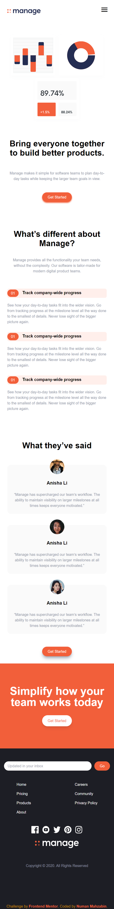
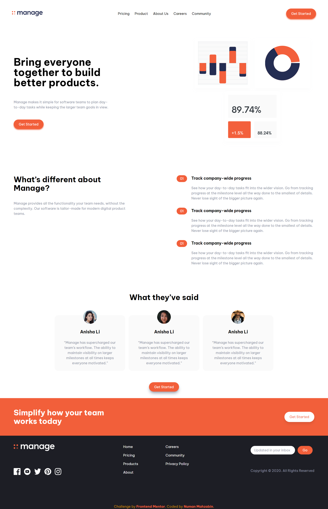

# Frontend Mentor - Manage landing page solution

This is a solution to the [Manage landing page challenge on Frontend Mentor](https://www.frontendmentor.io/challenges/manage-landing-page-SLXqC6P5). Frontend Mentor challenges help you improve your coding skills by building realistic projects.

## Table of contents

- [Overview](#overview)
  - [The challenge](#the-challenge)
  - [Screenshot](#screenshot)
  - [Links](#links)
- [My process](#my-process)
  - [Built with](#built-with)
  - [What I learned](#what-i-learned)
  - [Continued development](#continued-development)
  - [Useful resources](#useful-resources)
- [Author](#author)
<!-- - [Acknowledgments](#acknowledgments) -->

**Note: Delete this note and update the table of contents based on what sections you keep.**

## Overview

### The challenge

Users should be able to:

- View the optimal layout for the site depending on their device's screen size
- See hover states for all interactive elements on the page
- See all testimonials in a horizontal slider #[This function hasn't added yet]
- Receive an error message when the newsletter sign up `form` is submitted if:
  - The `input` field is empty
  - The email address is not formatted correctly

### Screenshot

### Links

- Solution URL: https://github.com/numanmahzabin/manage-landing-page
- Live Site URL: https://numanmahzabin.github.io/manage-landing-page/

## My process

This project is a part of my Tailwind CSS learning. I was studying Tailwind CSS and to practice it, I designed this site

### Built with

- HTML5
- Tailwind CSS [CSS Framework]
- Google Fonts
- Google Icons
- Mobile-first workflow

### What I learned

This is my first project in Tailwind CSS. I learned to make responsive and most importantly Mobile-first workflow. I learned to add custom fonts, colors in Tailwind.

Though I haven't learnt making slide bar with Tailwind. Therefore, I couldn't add the Slide bar in testimonial part. I'll, when I have this in hands.

### Continued development

I would like focus on making mobile menu bar with raw Javascript. As Tailwind doesn't have any builtin components, I had to do it all on my own. Also I need to focus on making slide bar. Besides, background position, forms are also where I need to pay attention.

### Useful resources

- https://tailwindcss.com/ - I was learning Tailwind CSS and the entire design was made with Tailwind
- https://fonts.google.com/ - I used 'Be Vietnam Pro' font from this site. Also I used the menu icon from the google icons.
- https://github.com/ - I deployed my site here.

## Author

- Website - [Numan Mahzabin](https://github.com/numanmahzabin)
- Frontend Mentor - [@numanmahzabin](https://www.frontendmentor.io/profile/numanmahzabin)
- Twitter - [@numanmahzabin](https://www.twitter.com/numanmahzabin)

<!-- ## Acknowledgments

This is where you can give a hat tip to anyone who helped you out on this project. Perhaps you worked in a team or got some inspiration from someone else's solution. This is the perfect place to give them some credit.

**Note: Delete this note and edit this section's content as necessary. If you completed this challenge by yourself, feel free to delete this section entirely.** -->
